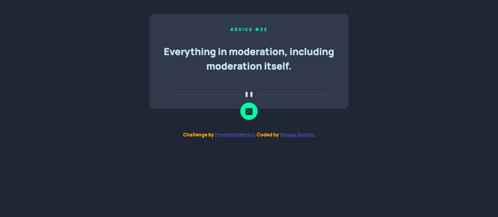
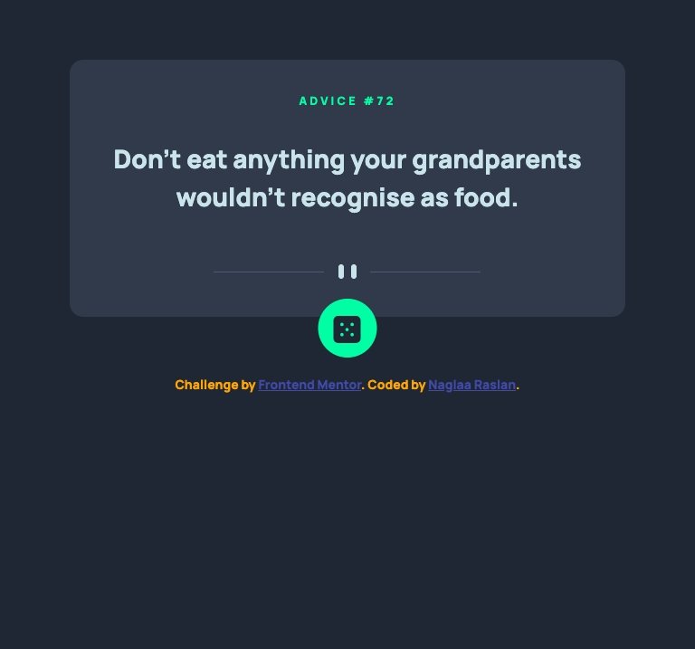
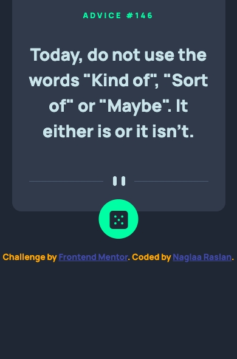

# Frontend Mentor - Advice generator app solution

This is a solution to the [Advice generator app challenge on Frontend Mentor](https://www.frontendmentor.io/challenges/advice-generator-app-QdUG-13db). Frontend Mentor challenges help you improve your coding skills by building realistic projects.

## Table of contents

- [Overview](#overview)
  - [The challenge](#the-challenge)
  - [Screenshot](#screenshot)
  - [Links](#links)
- [My process](#my-process)
  - [Built with](#built-with)
  - [What I learned](#what-i-learned)
- [Author](#author)

**Note: Delete this note and update the table of contents based on what sections you keep.**

## Overview

### The challenge

Users should be able to:

- View the optimal layout for the app depending on their device's screen size
- See hover states for all interactive elements on the page
- Generate a new piece of advice by clicking the dice icon

### Screenshot

- Desktop :;

- Ipad :
- Mobile :;

### Links

- Solution URL: [Repo Link](https://github.com/codeAndcocoa/advice-generator-app.git)
- Live Site URL: [Live Link](https://codeandcocoa.github.io/advice-generator-app/)

## My process

### Built with

- Semantic HTML5 markup
- CSS custom properties
- Bootstrap 5
- Desktop-first workflow
- Vanilla javascript

**Note: These are just examples. Delete this note and replace the list above with your own choices**

### What I learned
- I learned how to fetch api.

## Author
- Website - [Github profile](https://github.com/codeAndcocoa)
- Frontend Mentor - [@codeAndcocoa](https://www.frontendmentor.io/profile/codeAndcocoa)

